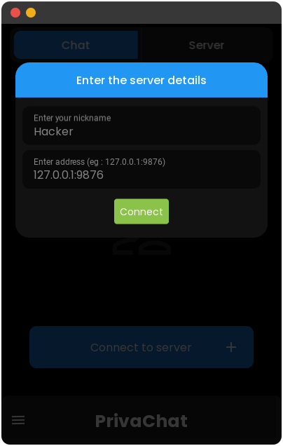
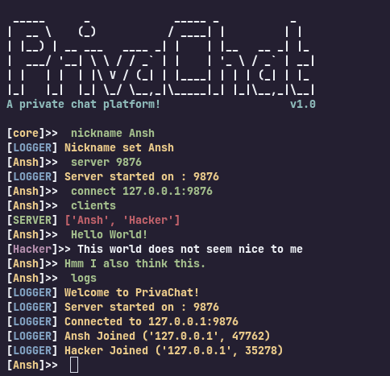
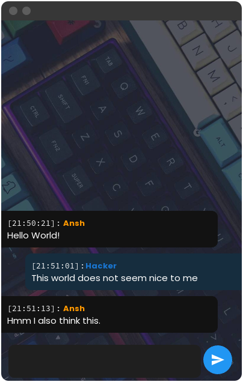

# PrivaChat

<p align="center">


</p>

*A private chat platfrom for your gf (btw I am not having any)*

> For ultimate hackers!

## Modes

### GUI
It is having a very friendly gui for **noobs**

<p align="center">

</p>
### CLI
Hi Linux Pro Hackers. Welcome! Its for you

|CLI|GUI|
| ------ | ------ |
|||

## Install
Its simple, install python and following deps using pip
```python
kivy==2.1.0
kivymd=1.1.0
colorama
plyer
```
for gui run
```shell
python3 main.py
```
for cli run
```shell
python3 cli.py
```
For apks see releases
> Cli also works on termux

## Chat Features (In GUI) 

* Message Hiding
> 
